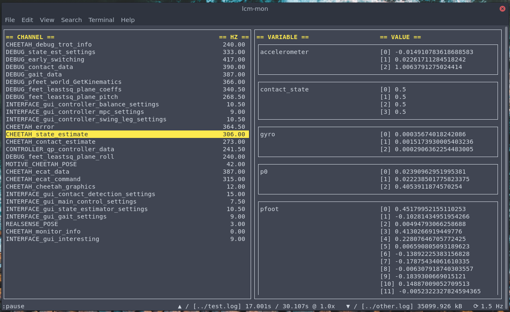

# lcm-mon

`lcm-mon` is a command-line monitor program for the Lightweight Communications and Marshalling library, LCM. `lcm-mon` is intended for monitoring, debugging, and visualization purposes in robotics applications, and supports features such as previewing messages, reading and writing logs, and graphing message data. It has a `vim`-style minimalist interface that is powerful when needed.

## Preview

## Commands

The following commands are supported:

* `:q[uit]` -- Quit `lcm-mon`.
* `:l[og] [filepath]` -- Start or stop logging. If `filepath` is given, it logs to that file. Otherwise, it chooses a random filename in the current directory. Running `:l[og]` when `lcm-mon` is already logging stops logging and dumps the file.
* `:p[lay] <filepath> [speed]` -- Play the log at `filepath`. If `speed` is given, it plays it back at that speed (default is `1.0`).
* `:p[lay] [speed]` -- If `lcm-mon` has loaded a log to play (either currently playing or paused), set its playback speed to `speed`.
* `:p[ause]` -- Pause playback of the currently loaded log.
* `:p[lay]` -- Resume playback of the currently loaded log.
* `s[eek] <position>` -- Seek to a particular position (in seconds) in a log loaded for playing. If `position` is specified as `+<value>` or `-<value>`, jump relative to the current position in the log; if `position` is specified as `<value>`, jump to that absolute position in the log.
* `:r[efresh] <rate>` -- Set the refresh rate (in Hz) of the displays and graphs to `rate` (default is `1.5`)
* `:v[iew]` -- Graph the currently selected variable on a time-series plot. Multiple variables can be plotted by running `:v` on each variable to plot, and already plotted variables can be toggled and removed from the plot by running `:v` again.
* `:v[iew] -` -- Stop plotting all variables currently being plotted.
* `:c[lear]` -- Clear the display of all channels and variables.
